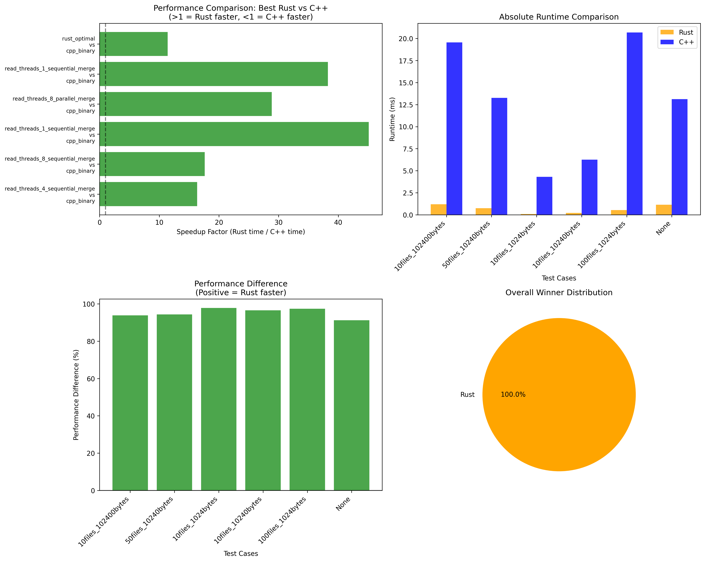

# fast-wc-rust

A high-performance word counting tool for C and header files, implemented in Rust with multiple optimization strategies.

## Table of Contents

- [Comparison Results](#comparison-results)
- [Overview](#overview)
- [Features](#features)
- [Dependencies](#dependencies)
- [Installation](#installation)
- [Usage](#usage)
- [Benchmarking](#benchmarking)
- [Performance Comparison](#performance-comparison)
- [Project Structure](#project-structure)
- [Algorithm](#algorithm)
- [Testing](#testing)

## Comparison Results

With the 80-file test composed in `compare/generate-files/`, which contains about 3.5 million total lines, `hyperfine` provided the following output:
```bash
Benchmarking with hyperfine...
Benchmark 1: /root/fast-wc-rust/compare/../fast-wc-rust/target/release/fast-wc-rust ./generated_input/
  Time (mean ± σ):     243.1 ms ±  19.8 ms    [User: 1670.7 ms, System: 29.5 ms]
  Range (min … max):   224.4 ms … 284.7 ms    10 runs
 
Benchmark 2: /root/fast-wc-rust/compare/../competitors/fast-cpp/fast-wc ./generated_input/
  Time (mean ± σ):      2.673 s ±  0.123 s    [User: 2.635 s, System: 0.038 s]
  Range (min … max):    2.556 s …  2.888 s    10 runs
 
Summary
  /root/fast-wc-rust/compare/../fast-wc-rust/target/release/fast-wc-rust ./generated_input/ ran
   10.99 ± 1.03 times faster than /root/fast-wc-rust/compare/../competitors/fast-cpp/fast-wc ./generated_input/
```

With the (less fair) Rust benchmarking code, this output is provided:



These tests were completed on an 8-core, 8GB RAM server container with an Intel(R) Xeon(R) W-2135 CPU @ 3.70GHz.

## Overview

`fast-wc-rust` is designed to efficiently count words (tokens) in C source files (.c) and header files (.h). It relies on multiple dependencies and implements several performance optimizations including:

- **Multi-threading**: Configurable number of worker threads
- **Memory mapping**: Optional memory-mapped file I/O for better performance
- **Parallel merging**: Parallel reduction of per-thread word counts
- **Fast tokenization**: Optimized character classification using lookup tables
- **Hash map optimization**: Uses `ahash` for faster hashing

## Features

- Scans directories recursively for `.c` and `.h` files
- Configurable threading (defaults to number of CPU cores)
- Memory-mapped I/O option for large files
- Parallel vs sequential result merging
- Performance statistics and benchmarking
- Silent mode for batch processing
- Top-N results filtering

## Dependencies

- `ahash` - Fast hashing algorithm
- `anyhow` - Error handling
- `clap` - Command line argument parsing
- `crossbeam` - Lock-free data structures and threading
- `memmap2` - Memory-mapped file I/O
- `num_cpus` - CPU core detection
- `rayon` - Data parallelism
- `walkdir` - Directory traversal

## Installation

```bash
cd fast-wc-rust
cargo build --release
```

## Usage

```bash
# Count words in current directory with default settings
./target/release/fast-wc-rust .

# Use specific number of threads
./target/release/fast-wc-rust -n 8 /path/to/source

# Disable memory mapping
./target/release/fast-wc-rust -m false /path/to/source

# Enable parallel merging and show only top 100 results
./target/release/fast-wc-rust -p -t 100 /path/to/source

# Silent mode (no progress output)
./target/release/fast-wc-rust -s /path/to/source
```

## Benchmarking

The project includes comprehensive benchmarks comparing different configurations. See `compare/rust-bench` for more.

## Performance Comparison

This implementation is benchmarked against a C++ reference implementation (`competitors/fast-cpp/`). The `compare/` directory contains:

- Tools for performance analysis, see `run-all.sh`
- Scripts to easily run benchmarking and python-assisted runtime comparison on large generated files.

See `compare/` for more.

## Project Structure

- `fast-wc-rust/` - Main Rust implementation
- `compare/` - Performance comparison tools and results
- `competitors/fast-cpp/` - C++ reference implementation
- Benchmark results are stored in `compare/rust-bench/criterion/`

## Algorithm

The word counting algorithm:

1. Discovers all `.c` and `.h` files recursively
2. Distributes files across worker threads
3. Each thread processes files using either memory mapping or standard I/O
4. Extracts words using optimized tokenization (alphanumeric + underscore)
5. Merges per-thread hash maps either sequentially or in parallel
6. Sorts results by count (descending) then alphabetically

## Testing

```bash
cargo test
```
